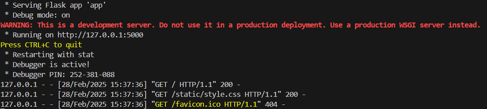
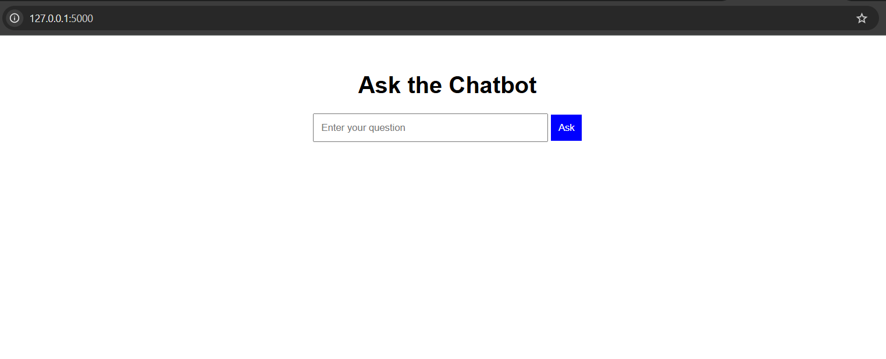
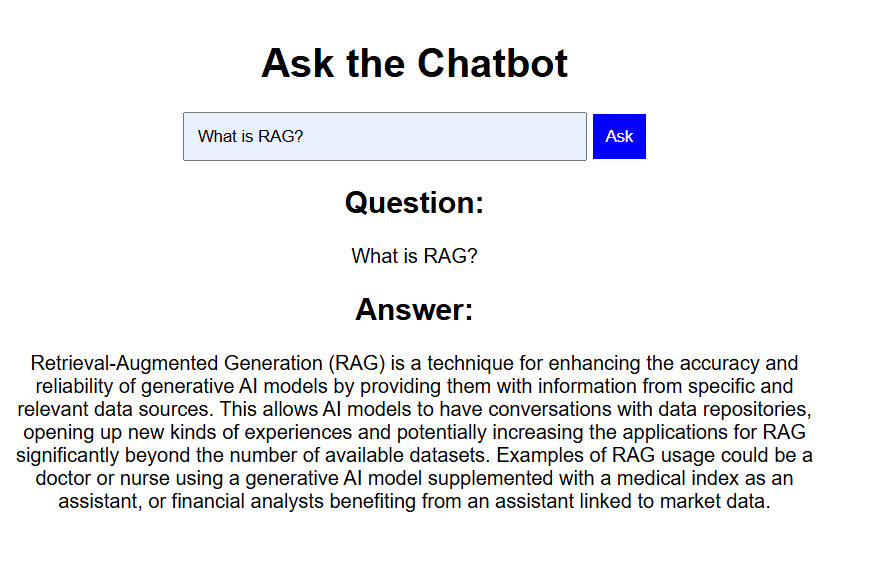

# RAG-Chatbot

## 📌 Project Overview

This project implements a simple Retrieval-Augmented Generation (RAG) chatbot using a vector database for semantic search and a MySQL database to store chat history. The chatbot is served via a Flask API.

## 🚀 Features

    1. Utilizes ChromaDB for efficient vector-based retrieval.
    2. Uses SentenceTransformer for text embeddings.
    3. Stores chat history in MySQL.
    4. Provides RESTful API endpoints for interaction.

## 📂 Project Structure

    /project-root
    │── embeddings.py       # Handles text chunking and vector storage
    │── database.py         # Manages MySQL chat history
    │── model.py            # Generates responses using Ollama and RAG
    │── routes.py           # Defines Flask API routes
    │── app.py              # Main Flask app
    │── .env                # Environment variables (MySQL credentials)
    │── data.txt            # Sample text data
    │── README.md           # Project documentation
    
    /static
    |── style.css           # css styles
    /templates
    |── index.html          # html file

## 🛠 Installation

### 🔧 Prerequisites
Ensure you have the following installed:

    1. Python 3.10+

    2. MySQL Server

    3. Docker (optional for MySQL setup)

    4. pip and virtual environment tools

## 🛠 Setting Up the Project from Scratch
If you don't want to clone the repository and prefer to build it from scratch, follow these steps:

1. Create a new directory for your project
    ```mkdir rag-chatbot && cd rag-chatbot```
2. Initialize a Python virtual environment:
```bash 
python -m venv venv 
venv\Scripts\activate
```
3. Install required dependencies:
```python
pip install flask chromadb langchain sentence-transformers mysql-connector-python ollama dotenv
```
4. Create the necessary python files:
```python 
touch embeddings.py database.py model.py routes.py app.py
```
5. Setup the .txt file with sample text data
```bash 
echo "Sample text for embeddings." > data.txt
``` 
6. Setup up the environment variables: Create a ```.env``` file and add your MySQL credentials:
```bash
echo "MYSQL_pass=your_mysql_password" > .env
```
## 🛠 Setting Up MySQL
### 🚀 Start MySQL Server
If MySQL is not installed, you can install it from the following link:
[Download MySQL](https://dev.mysql.com/downloads/workbench/)

### 📌 Create Database & Table
Login to MySQL:
``` mysql -u root -p ```
Run the following SQL commands:
```sql
CREATE DATABASE chat_history;
USE chat_history;
CREATE TABLE chat(
    id INT AUTO_INCREMENT PRIMARY KEY,
    timestamp TIMESTAMP DEFAULT CURRENT_TIMESTAMP,
    role VARCHAR(10),
    content TEXT
);
```
## 🚀 Running the Chatbot
### 📝 Store Text Embeddings in Vector Database
``` python embeddings.py ```
### 🌐 Start the Flask API
``` python app.py ```

##### Click on the above devlopment server link.

Now, you can ask the question to your Chatbot based on the provided document.
 

## 🔍API Usage
### 1️⃣ POST/chat-Generate a response 
Request:
``` bash 
curl -X POST http://localhost:5000/chat -H "Content-Type: application/json" -d '{"query":"What is RAG?"}'
```
Response:
{
    "answer": " Retrieval-Augmented Generation (RAG) is a technique that enhances the accuracy and reliability of generative AI models by providing them with information from specific and relevant data sources. Essentially, it allows AI models to have conversations with data repositories, opening up new experiences and applications across various fields such as healthcare, finance, and more.",
    "retrieved_chunks": "How It Got Named ‘RAG’\n\nAnother great advantage of RAG is it’s relatively easy. A blog by Lewis and three of the paper’s coauthors said developers can implement the process with as few as five lines of code.\n\nThat makes the method faster and less expensive than retraining a model with additional datasets. And it lets users hot-swap new sources on the fly.\n\n“We always planned to have a nicer sounding name, but when it came time to write the paper, no one had a better idea,” said Lewis, who now leads a RAG team at AI startup Cohere.\nSo, What Is Retrieval-Augmented Generation (RAG)? \nRetrieval-augmented generation is a technique for enhancing the accuracy and reliability of generative AI models with information fetched from specific and relevant data sources.\n\nHow People Are Using RAG\nWith retrieval-augmented generation, users can essentially have conversations with data repositories, opening up new kinds of experiences. This means the applications for RAG could be multiple times the number of available datasets.\n\nFor example, a generative AI model supplemented with a medical index could be a great assistant for a doctor or nurse. Financial analysts would benefit from an assistant linked to market data.\n\ntext = \"\"\"What Is Retrieval-Augmented Generation, aka RAG?\nRetrieval-augmented generation is a technique for enhancing the accuracy and reliability of generative AI models with information from specific and relevant data sources.To understand the latest advancements in generative AI, imagine a courtroom."
}
## 2️⃣ GET /history – Retrieve chat history
Request:
```bash 
curl -X GET http://localhost:5000/history
```
Response:
{
        "content": "What is RAG?",
        "id": 13,
        "role": "user",
        "timestamp": "Fri, 28 Feb 2025 16:17:26 GMT"
    },
    {
        "content": " Retrieval-Augmented Generation (RAG) is a technique for enhancing the accuracy and reliability of generative AI models by providing them with information from specific and relevant data sources. This allows AI models to have conversations with data repositories, opening up new kinds of experiences and potentially increasing the applications for RAG significantly beyond the number of available datasets. Examples of RAG usage could be a doctor or nurse using a generative AI model supplemented with a medical index as an assistant, or financial analysts benefiting from an assistant linked to market data.",
        "id": 14,
        "role": "system",
        "timestamp": "Fri, 28 Feb 2025 16:17:26 GMT"
    },
    {
        "content": "How RAG helps to save the resource and time?",
        "id": 11,
        "role": "user",
        "timestamp": "Tue, 25 Feb 2025 12:09:03 GMT"
    }

## 📦 Dockerizing the Application 
Create a ```Dockerfile``` in the project root:
```bash
FROM python:3.12
WORKDIR /app
COPY . . 
RUN pip install -r requirements.txt
CMD ["python","app.py"]
```
To build and run the Docker container:
```bash
docker build -t rag-chatbot .
docker run -p 5000:5000 rag-chatbot
```

